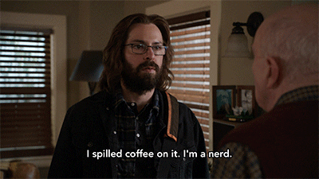

<h2> About me </h2>

  
Hello World, I’m Daman. A highly motivated software developer pursuing Master of Engineering at [Carleton University][carleton]. Before going back to school to start my journey towards the graduate degree, I studied [Computer Systems Technician][cst] at [Algonquin College][algonquin] where I used to hack around cisco routers & switches, and got the opportunity to work as an Intern as well as a Full Time Software Engineer in the Cloud And Cognitive Support business unit of [IBM Canada][ibm]. Other than that...

- :sunflower: I like giving back to the developer community by contributing to  projects, notably [Kubernetes][kubernetes].
- :speech_balloon:  I love talking about Stock Market, Finance, DevOps, SDLC, Containers, Java, Kubernetes, Open Source, Cloud, Python, Data Analytics, Business Intelligence.
- 🥇 I am a member of the Inaugural Class of Community Advocates at [Ambassador Labs][Ambassador Labs] for the period of 2021-2022
- :computer: I am a [Certified Kubernetes Administrator][Cka]
- :microphone:  My pronouns are [he/him][pronoun]
- :mailbox:  You can reach out to me at `@DaemonSets` on [Twitter][twitter]
- :pencil:  I write occasionally on my [blog][blog]

Basically, I'm a computer nerd that absolutely ❤️ s ☕. Yes it's trite...but I'm owning it.

  

<h2> I'm currently ...</h2>

  
- :gear: Spending summer of 2021 shadowing on the [Kubernetes v1.22 Release Team][release]
- 🌱 Learning and researching various Cloud, CI/CD pipelines, Container services, DevOps Processes @ [York University][yorku]
- :school:  Working towards Master of Engineering @  [Carleton University][carleton]
- 📚 Reading (or trying to read) : **"The Phoenix Project: A Novel about IT, DevOps, and Helping Your Business Win"**

<!--h2>Random</h2-->

[algonquin]: https://www.algonquincollege.com/sat/program/computer-systems-technician/
[blog]: https://daemonsets.github.io/
[carleton]: https://carleton.ca/sce/
[kubernetes]: //kubernetes.io
[pronoun]: //pronoun.is/he
[twitter]: https://twitter.com/DaemonSets
[cst]: https://www.algonquincollege.com/sat/program/computer-systems-technician/
[ibm]: https://www.ibm.com/cloud
[yorku]: https://continue.yorku.ca/programs/certificate-in-devops/
[release]: https://github.com/kubernetes/sig-release/blob/master/releases/release-1.22/release-team.md
[Ambassador Labs]: https://blog.getambassador.io/meet-the-inaugural-class-of-ambassador-community-advocates-53f5d52a741e
[Cka]: https://www.credly.com/badges/57c437b3-d998-4d97-9276-1f968c39b883/public_url
