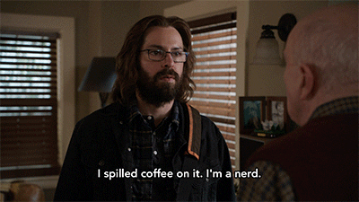

<h2> About me </h2>

 
Hello World, My name is [Daman (pronounced as duh-men)](https://www.howtopronounce.com/hindi/daman). I am a relationship-oriented, tech-savvy software professional with strong technical & analytical skills. I am passionate about writing code, and I am always looking for new opportunities that will help me learn better ways to develop. Working with others and discussing development terms are among my favorite pastimes. You may... 
  
- Give me data, and I can extract knowledge and insights for you.
- Tell me what you need, and I can design a solution.
- Give me a coding problem, and I can solve it efficiently.
  
Other than that...

- :sunflower: I enjoy giving back to the developer community by contributing to   projects.
- :speech_balloon:  I love talking about Go, Python, JavaScript, Java, Stock Market, Finance, DevOps, SDLC, Containers, Kubernetes, Open Source, Cloud, Data Analytics, Business Intelligence.
- :microphone:  My pronouns are [he/him][pronoun]
- :mailbox:  You can reach out to me at `@DamanAroraCa` on [Twitter][twitter]
- :pencil:  I write occasionally on my [blog][blog]

Basically, I'm a computer nerd that absolutely ❤️ s ☕. Yes it's trite...but I'm owning it.

  

<h2> I'm currently ...</h2>

- 🖱️ Working as a frontend software developer at [Ciena][ciena]
- 📚 Reading (or trying to read): **"The Phoenix Project: A Novel about IT, DevOps, and Helping Your Business Win"**

<h2>Random</h2>

- ⭐ Worked as a [Google Summer Of Code Intern][cloudstack] at the [Apache Software Foundation][theasf]
- 📰 I've co-authored a research paper on leveraging [machine learning to categorize the market offers of innovative digital health companies][research].
- 🥇 I am a member of the Inaugural Class of Community Advocates at [Ambassador Labs][Ambassador Labs] for the period of 2021-2022
- :computer: I am a [Certified Kubernetes Administrator][Cka]
- :gear: I have shadowed on the [Kubernetes Release Team][release] for version 1.22 and 1.23
- 👨‍🎓 I have been an open source software engineering fellow at [AWS][aws] via [MLH Fellowship][fellowship]

 
<a href="">

  
 
  
  

  

  
  

</a>

[fellowship]: https://fellowship.mlh.io/  
[algonquin]: https://www.algonquincollege.com/sat/program/computer-systems-technician/
[blog]: https://daemonsets.github.io/
[carleton]: https://carleton.ca/sce/
[kubernetes]: //kubernetes.io
[pronoun]: //pronoun.is/he
[twitter]: https://twitter.com/you_da_man_
[cst]: https://www.algonquincollege.com/sat/program/computer-systems-technician/
[ibm]: https://www.ibm.com/cloud
[yorku]: https://continue.yorku.ca/programs/certificate-in-devops/
[release]: https://github.com/kubernetes/sig-release/blob/master/releases/release-1.22/release-team.md
[Ambassador Labs]: https://blog.getambassador.io/meet-the-inaugural-class-of-ambassador-community-advocates-53f5d52a741e
[Cka]: https://www.credly.com/badges/57c437b3-d998-4d97-9276-1f968c39b883/public_url
[TrinoDB]: https://trino.io/
[research]: https://timreview.ca/sites/default/files/article_PDF/TIMReview_2021_Issue_7-8-5.pdf
[aws]: https://gradstudents.carleton.ca/2022/tim-grad-student-picked-for-highly-selective-fellowship/
[ciena]: https://www.ciena.com/
[cloudstack]: https://summerofcode.withgoogle.com/programs/2022/projects/ZVraist1
[theasf]: https://www.apache.org/

